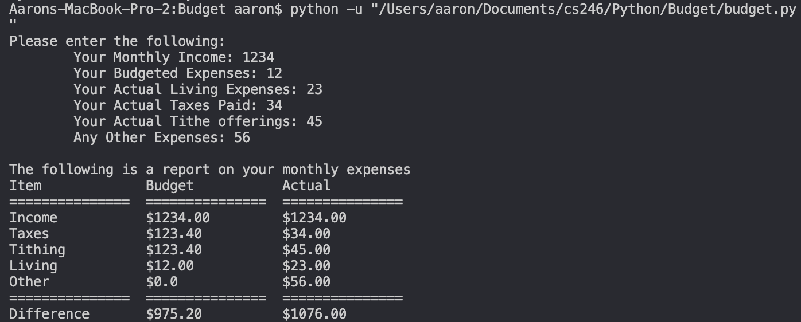

# Description
This program allows users to input all their monthly expenses and recieve a table of their monthly budget.  The code will request numerical ammounts for different budget values and output said values to a table, showing differences between actual expenses and the user's expected budget.

# Execution
>python -u path/to/file/budget.py

# Useful Sites

https://www.w3schools.com/python/
